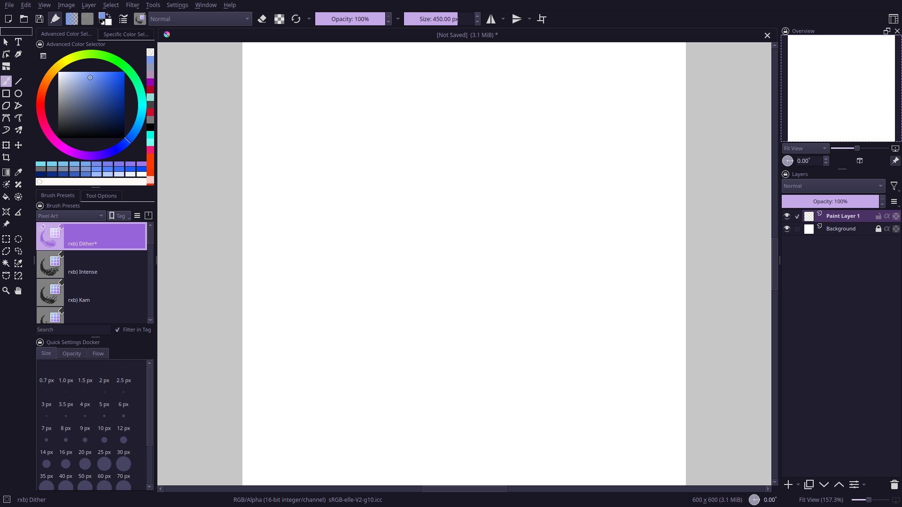
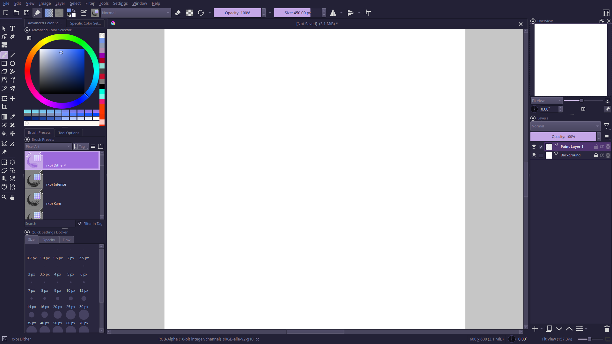
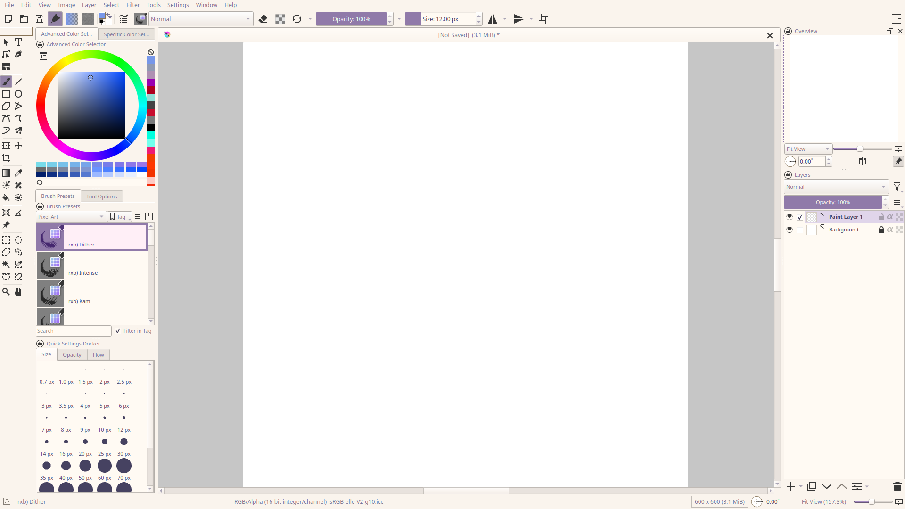

    
    <h2 align="center">Rosé Pine for Krita</h2>

All natural pine, faux fur and a bit of soho vibes for the classy minimalist

## Usage

1. Download Variant(s) from [dist](./dist)
2. Under **Settings, Manage Resources...** select **Open Resource Folder**
3. Copy .colors file(s) into Krita's `color-schemes` folder
4. Under **Settings, Themes** select variant

## Gallery

### Rosé Pine

### Rosé Pine Moon

### Rosé Pine Dawn

## Thanks to

- [RoseDelightful](https://github.com/rosedelightful)

